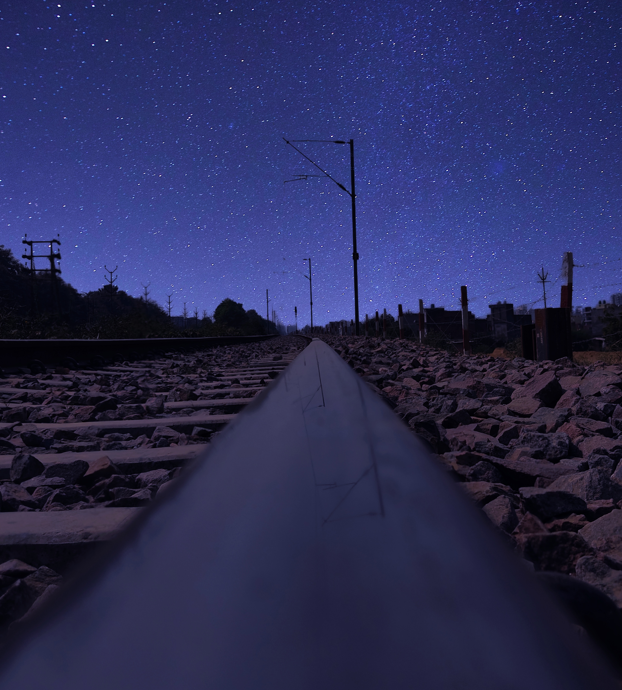
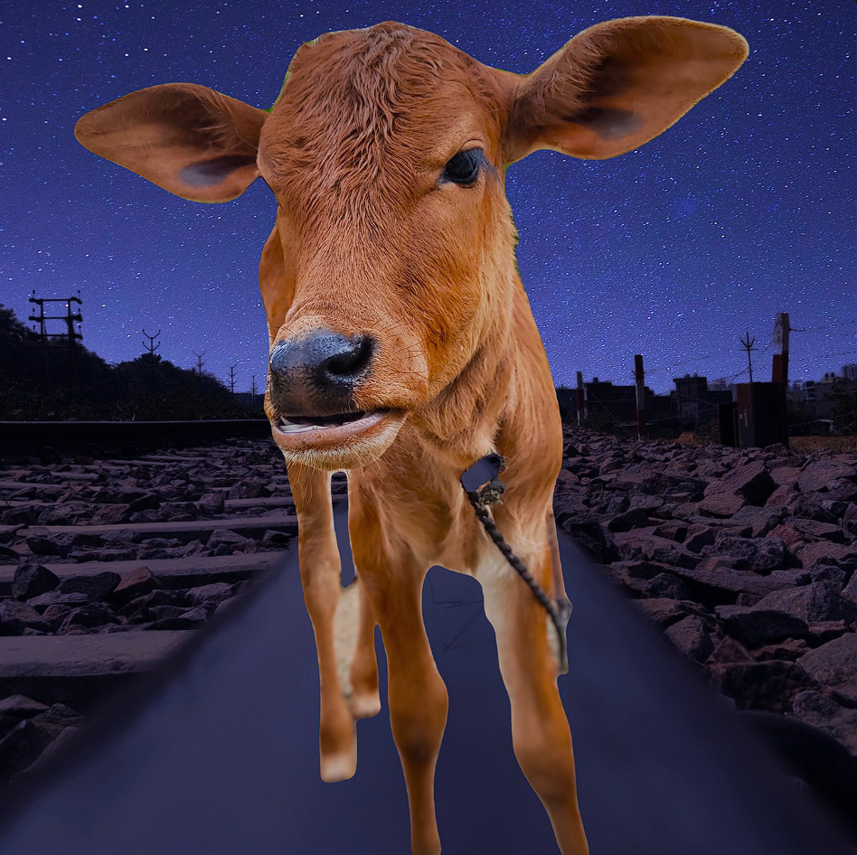
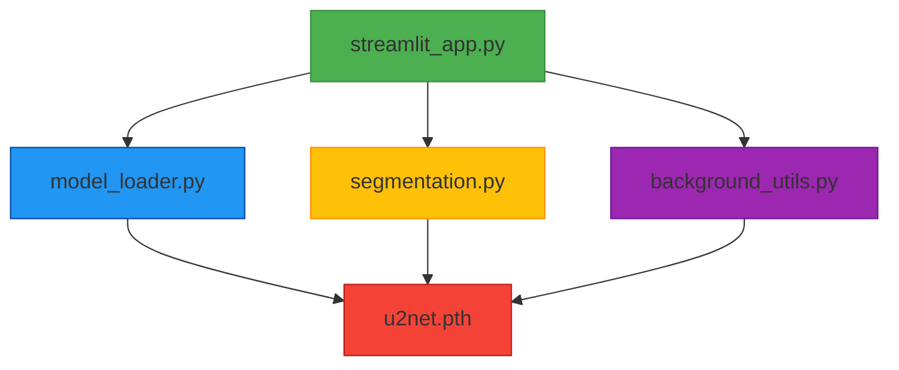

<!-- Animated header section with floating emojis -->
<div align="center">
  
  <h1 align="center">✨ AI‑Powered Background Remover </h1>

  > **Instantly remove or replace image backgrounds** using a state‑of‑the‑art U²‑Net deep‑learning model, wrapped in a sleek Streamlit UI.
  
  <p align="center">
    
    <br>
    <em>Live demo: remove background, apply blur, color fill or custom image in seconds.</em>
  </p>
  
  <div>
    
    
    
  </div>
</div>

---

<div align="center">
  <a href="https://ai-powered-background-remover-586czjzdqxbhwjzz3uugb9.streamlit.app/">
    
  </a>
</div>

---

<!-- Animated features section -->
## ✨ <span class="animated-text">Key Features</span>

<p align="center">
  
</p>

| Feature | Description | Emoji |
|---------|-------------|-------|
| **Background Removal** | Generate transparent PNGs with perfect edges | 🖼️ |
| **Multiple Modes** | Blur, solid-color, or custom image backgrounds | 🎨 |
| **Threshold Control** | Fine-tune mask sensitivity with real-time preview | ⚙️ |
| **Batch Processing** | Process multiple images simultaneously | 🔄 |
| **Instant Results** | Streamlit-powered responsive UI | ⚡ |

---

<!-- Enhanced demo section with animated tabs -->
## 📺 <span class="demo-header">Interactive Demo</span>

[](https://ai-powered-background-remover-586czjzdqxbhwjzz3uugb9.streamlit.app/)

<div align="center">
  <a href="https://ai-powered-background-remover-586czjzdqxbhwjzz3uugb9.streamlit.app/">
    
  </a>
  <br>
  <em>Click the GIF to experience the live app!</em>
</div>

<div align="center">
  
</div>

<details>
<summary><b>🎚️ Click to see transformation examples</b></summary>
  
| Step | Original | Mask | Result |
|------|----------|------|--------|
| Background Removal |  |  |  |
| Custom Background |  |  |  |
  
</details>

---

<!-- Installation with animated terminal -->
## 🚀 <span class="install-header">Installation Guide</span>

```bash
# Clone repository with fancy progress
git clone https://github.com/irkky/AI-Powered-Background-Remover.git && \
cd AI-Powered-Background-Remover

# Create virtual environment
python3 -m venv venv

# Activate environment
source venv/bin/activate  # Linux/Mac
venv\Scripts\activate    # Windows

# Install requirements
pip install -r requirements.txt

# Download U²‑Net weights
mkdir -p checkpoints && \
wget https://github.com/xuebinqin/U-2-Net/releases/download/v1.0/u2net.pth -O checkpoints/u2net.pth
```

---

<!-- Usage with animated GIF -->
## 🎮 <span class="usage-header">Live Usage</span>

```bash
# Launch the application
streamlit run app/streamlit_app.py
```

<div align="center">
  
</div>

1. **Upload** images (JPG/PNG) 📤
2. **Select** background mode 🧪
3. **Adjust** parameters with real-time preview 🔍
4. **Download** results with one click 💾

---

## 🏗️ Project Structure 📂



---

```text
ai-background-remover/
├── app/
│   └── streamlit_app.py           # Streamlit frontend
├── core/
│   ├── model_loader.py            # Loads U²‑Net model
│   ├── segmentation.py            # Inference & mask post‑processing
│   ├── background_utils.py        # BG removal & replacement
│   └── image_io.py                # I/O utilities
├── model/
│   └── u2net.py                   # U²‑Net architecture
├── checkpoints/
│   └── u2net.pth                  # Download from U²-Net GitHub
├── assets/                        # Demo images & masks
├── demo/
│   └── demo.mp4                   # Project demo video
├── requirements.txt
├── setup.sh                       # One‑click setup script
└── README.md
```

---

<!-- Footer with animated emojis -->
<div align="center">
  <h3>Show your support by starring ⭐ this repository!</h3>
  <p>
     
    
  </p>
</div>

---
